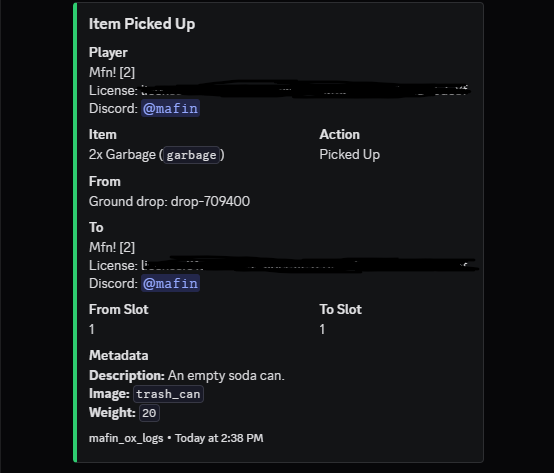
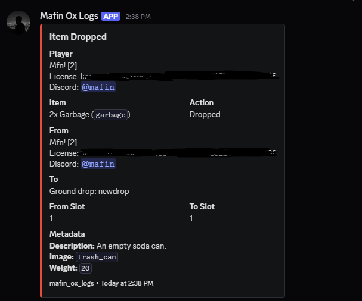

# MAFIN_OX_LOGS

Server-side Discord webhook logs for `ox_inventory` item movement.

## Preview
### Item Picked Up


### Item Dropped


## Features
- Logs item drops
- Logs item pickups from ground drops
- Logs player-to-player item sharing
- Logs putting items into stashes, trunks, and gloveboxes
- Logs taking items from stashes, trunks, and gloveboxes
- Uses ox_inventory post-hook events, so logs only run after the action finishes
- Server-only resource with no client scripts
- Webhook is not sent to players or client resource dumps
- Discord `allowed_mentions` disabled to prevent item names or metadata from pinging roles/users
- Small webhook queue to reduce Discord rate-limit spam

## Installation
1. Put the `mafin_ox_logs` folder in your server resources.
2. Make sure `ox_inventory` starts before this resource.
3. Add this to `server.cfg`:

```cfg
ensure ox_inventory
ensure mafin_ox_logs
```

## Webhook Setup
The webhook is configured as a normal full URL inside server-only `config.lua`:

```lua
Config.Discord = {
    Webhook = 'https://discord.com/api/webhooks/YOUR_WEBHOOK_HERE',
    BotName = 'Mafin Ox Logs',
    AvatarUrl = '',
    Footer = 'mafin_ox_logs',
    DisableMentions = true
}
```

## Configuration
Edit `config.lua`:

- `Config.Discord` controls webhook URL, bot name, avatar, footer, and mention protection.
- `Config.Logging` controls console output, queue speed, metadata, player IDs, Discord IDs, slots, metadata labels, and metadata order.
- `Config.EnabledLogs` enables/disables each log type.
- `Config.LogTypes` controls Discord embed title, action text, and color for every log type.

Metadata is shown as clean Discord lines instead of raw JSON:

```md
Description: An empty soda can.
Image: `trash_can`
Weight: `20`
```

## Security Notes
- This resource has `server_only 'yes'` in `fxmanifest.lua`.
- There are no `client_scripts`.
- There are no registered client events or callbacks that expose the webhook.
- Do not put the webhook in shared or client files.
- Anyone with direct server file access can still read server files, so use file permissions and rotate the webhook if it was posted publicly.

## Requirements
- FiveM artifact with Lua 5.4 support
- `ox_inventory`
